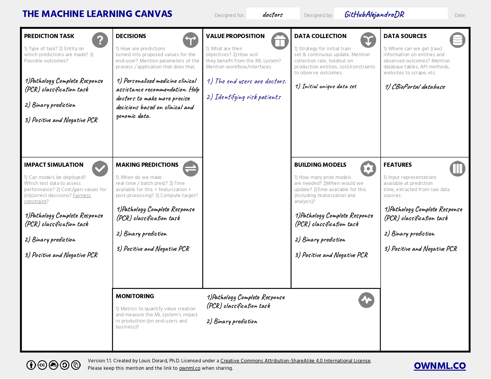

# ML Clinical PCR Prediction Project

## Table of Contents

- [Project Description](#project-description)
- [Technologies](#Technologies)
  - [Key Features](#key-features)
- [Getting Started](#getting-started)
  - [Prerequisites](#prerequisites)
  - [Installation](#installation)
- [Project Structure](#project-structure)
- [Usage](#usage)


## Project Description

In this project, an MLOps setup is applied to address the challenge of pathologic complete response (PCR) in cancer. Clinical data downloaded from cBioPortal is utilized as the primary dataset. The project places special emphasis on data and model version control using tools like DVC and MLFlow. Moreover, it focuses on rigorous data and model testing, employing unit testing with Pytest, as well as additional libraries such as Pandera or Deepchecks.


## Technologies

| **Step** | **Technology** |
|---------|---------------|
| Package Dependency | Poetry |
| Configuration Modularity | Hydra |
| Data Versioning | DVC (Data Version Control) |
| Model Versioning | MLFlow |
| Hyperparameters Optimization | HyperOpt |
| Unit Testing | Pytest |
| Data Testing | Pandera |
| Model Testing | Deepcheck |

### Key Features

- **MLOps Implementation:** The project adopts a structured MLOps approach that includes careful consideration of package dependency management using Poetry and configuration modularity with Hydra.
- **Version Control:** Leveraging tools such as DVC for managing data versions and MLFlow for tracking model versions.
- **Hyperparameter Optimization:** Implementing HyperOpt to fine-tune and optimize model hyperparameters.
- **Testing Framework:** Rigorous testing methodologies involving Pytest for unit testing, Pandera for data testing, and Deepcheck for model testing.


## Getting Started

<!--



 
-->

### Prerequisites

Before you begin working with this project, make sure you have the following prerequisites installed on your system:

- [Python](https://www.python.org/downloads/): This project is developed in Python, and you'll need Python 3.6 or higher. You can download Python from the official [Python website](https://www.python.org/downloads/).

- [Poetry](https://python-poetry.org/): Poetry is used for managing project dependencies and packaging. You can install Poetry by following the [official installation instructions](https://python-poetry.org/docs/#installation).

Once you've installed Python and Poetry, you can proceed with setting up and working with this project.

### Installation

To get your MLOps project up and running, follow these installation steps:

1. **Clone the project repository**:

   ```shell
   git clone https://github.com/your-username/your-mlops-project.git

2. Change Directory:

   ```shell
   cd your-mlops-project

3. Install Dependencies:

Ensure you have Poetry installed. If not, install it following the official instructions.

Install the project's dependencies using Poetry. It will read the pyproject.toml file to manage the dependencies:

```shell
   poetry install
```

4. Activate Virtual Environment:

```shell
  poetry shell
```
## Project Structure

The MLOps project is structured to maintain a well-organized and scalable workflow for managing machine learning models, data pipelines, and automation processes. Below is an overview of the key directories and their respective roles within the project:

- **`/.github`**: Github actions parent foder

   - **`/worflows`**: Github action workflows configurations

- **`/config`**: Main configuration file and folders with the data processing and model configurations parameters.

  - **`/model`**: Configurations files with model hyperparameters values
  - **`/process`**: Configuration files with parameters applied in data processing step.

- **`/docs`**: Project documentation, including guidelines, READMEs, and project-specific information.

  - **`/media`**: Media files used in documentation files

- **`/notebooks`**: Jupyter notebooks for exploratory data analysis (EDA) and model prototyping.

- **`/tests`**: Data and model unit tests.

- **`/training`**: Scripts applied in he training step..

