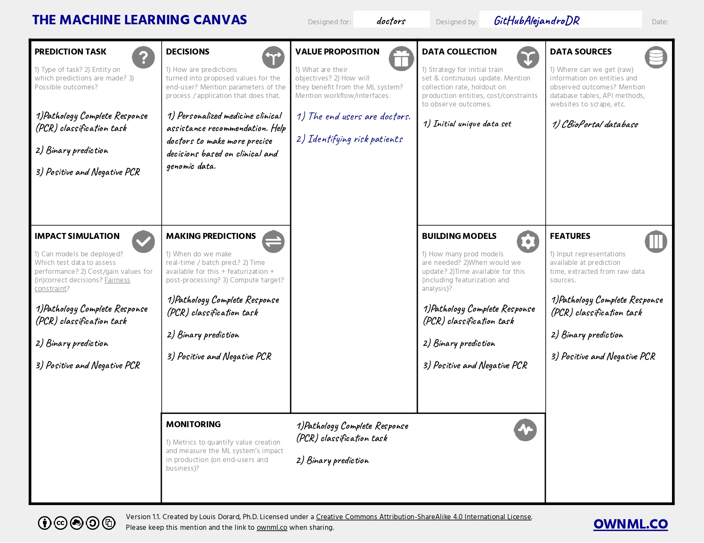

# MLOps Project Name

## Overview

[Provide a brief introduction to your MLOps project. Explain its purpose, the machine learning models it manages, and its role in the deployment and monitoring of those models.]

## Table of Contents

- [Project Description](#project-description)
- [Getting Started](#getting-started)
  - [Prerequisites](#prerequisites)
  - [Installation](#installation)
- [Project Structure](#project-structure)
- [Usage](#usage)
- [Model Management](#model-management)
- [Continuous Integration/Continuous Deployment (CI/CD)](#continuous-integrationcontinuous-deployment-cicd)
- [Monitoring](#monitoring)
- [Contributing](#contributing)
- [License](#license)
- [Acknowledgments](#acknowledgments)

## Project Description

[Explain the purpose and objectives of your MLOps project. Describe its role in managing machine learning models, from development to deployment and monitoring.]

- Model versioning for easy tracking and comparison.
- Streamline the model development lifecycle.

## Getting Started



<!---

-->  

[Provide instructions on how to set up and use the MLOps project locally. Include details on prerequisites and installation steps.]

### Prerequisites

Before you begin working with this project, make sure you have the following prerequisites installed on your system:

- [Python](https://www.python.org/downloads/): This project is developed in Python, and you'll need Python 3.6 or higher. You can download Python from the official [Python website](https://www.python.org/downloads/).

- [Poetry](https://python-poetry.org/): Poetry is used for managing project dependencies and packaging. You can install Poetry by following the [official installation instructions](https://python-poetry.org/docs/#installation).

Once you've installed Python and Poetry, you can proceed with setting up and working with this project.

### Installation

To get your MLOps project up and running, follow these installation steps:

1. **Clone the project repository**:

   ```shell
   git clone https://github.com/your-username/your-mlops-project.git

2. Change Directory:

   ```shell
   cd your-mlops-project

3. Install Dependencies:

Ensure you have Poetry installed. If not, install it following the official instructions.

Install the project's dependencies using Poetry. It will read the pyproject.toml file to manage the dependencies:

```shell
   poetry install
```

4. Activate Virtual Environment:

```shell
  poetry shell
```
## Project Structure

The MLOps project is structured to maintain a well-organized and scalable workflow for managing machine learning models, data pipelines, and automation processes. Below is an overview of the key directories and their respective roles within the project:

- **`/models`**: This directory houses trained machine learning models and their associated metadata.

  - **`/model1`**: Subdirectories for each specific model version.
    - `model.pkl`: The trained model file.
    - `metadata.json`: Model metadata, including hyperparameters and performance metrics.

- **`/data`**: Data-related files, datasets, and data versioning.

  - **`/datasets`**: Raw and processed datasets.
  - **`/features`**: Feature engineering scripts and transformations.

- **`/pipelines`**: Data processing and ML pipeline definitions.

  - **`/data_preprocessing`**: Scripts for data cleaning, transformation, and preprocessing.
  - **`/model_training`**: Machine learning model training and evaluation pipelines.
  - **`/deployment`**: Deployment automation scripts for model serving.

- **`/notebooks`**: Jupyter notebooks for exploratory data analysis (EDA) and model prototyping.

- **`/scripts`**: Utility scripts for various tasks, including data extraction, monitoring, and reporting.

- **`/config`**: Configuration files for environment settings, model parameters, and pipeline configurations.

- **`/tests`**: Unit tests and integration tests to ensure the functionality and reliability of pipelines and models.

- **`/docs`**: Project documentation, including guidelines, READMEs, and project-specific information.

- **`/logs`**: Log files generated by pipelines, models, and automation processes.

- **`/docker`**: Docker-related files for containerization and environment setup.

- **`/deployments`**: Scripts and configurations for model deployment, scaling, and monitoring.

This structured layout ensures that the project remains organized and follows best practices for reproducibility, scalability, and collaboration. It enables easy navigation, management, and tracking of models and pipelines in the MLOps workflow.


## Model Management
[Explain how models are managed within the project. Describe the model development process, version control, and how to add, update, or remove models.]

Model versioning and tracking through Git.

## Continuous Integration/Continuous Deployment (CI/CD)
[Discuss the project's CI/CD pipeline. Explain how code changes, including model updates, are tested, built, and deployed automatically.]

Automated testing using GitHub Actions.
Deployment to a cloud-based environment.

## Monitoring
[Detail how model performance and system health are monitored. Describe the tools and metrics used for tracking model behavior in production.]

## Monitoring with Prometheus and Grafana.
Performance metrics available in the project dashboard.

## Contributing
[Explain how others can contribute to the project. Provide guidelines for submitting code changes, bug reports, or feature requests.]

Fork the repository and create a feature branch.
Submit a pull request with your changes.

## License
[Specify the project's license. If it's open source, provide the full license text or a link to it.]

This project is licensed under the MIT License.# MLOps Project Name

## Overview

[Provide a brief introduction to your MLOps project. Explain its purpose, the machine learning models it manages, and its role in the deployment and monitoring of those models.]

## Table of Contents

- [Project Description](#project-description)
- [Getting Started](#getting-started)
  - [Prerequisites](#prerequisites)
  - [Installation](#installation)
- [Project Structure](#project-structure)
- [Usage](#usage)
- [Model Management](#model-management)
- [Continuous Integration/Continuous Deployment (CI/CD)](#continuous-integrationcontinuous-deployment-cicd)
- [Monitoring](#monitoring)
- [Contributing](#contributing)
- [License](#license)
- [Acknowledgments](#acknowledgments)

## Project Description

[Explain the purpose and objectives of your MLOps project. Describe its role in managing machine learning models, from development to deployment and monitoring.]

## Getting Started

[Provide instructions on how to set up and use the MLOps project locally. Include details on prerequisites and installation steps.]

### Prerequisites

[List the software, libraries, and tools required for the project. Include version information where necessary.]

### Installation

[Provide step-by-step instructions for installing and configuring the project. Include any necessary environment setup.]

## Project Structure

[Explain the organization and structure of the project. Describe the key directories, files, and their respective roles.]

## Usage

[Detail how to use the MLOps project. Include instructions for common tasks, such as model development, training, deployment, and monitoring.]

## Model Management

[Explain how models are managed within the project. Describe the model development process, version control, and how to add, update, or remove models.]

## Continuous Integration/Continuous Deployment (CI/CD)

[Discuss the project's CI/CD pipeline. Explain how code changes, including model updates, are tested, built, and deployed automatically.]

## Monitoring

[Detail how model performance and system health are monitored. Describe the tools and metrics used for tracking model behavior in production.]

## Contributing

[Explain how others can contribute to the project. Provide guidelines for submitting code changes, bug reports, or feature requests.]

## License

[Specify the project's license. If it's open source, provide the full license text or a link to it.]

## Acknowledgments

[Give credit to individuals, organizations, or projects that contributed to or inspired your MLOps project. Acknowledge any external tools or libraries used.]

[Optional: Add additional sections as needed, such as "Best Practices" or "Troubleshooting" sections.]
